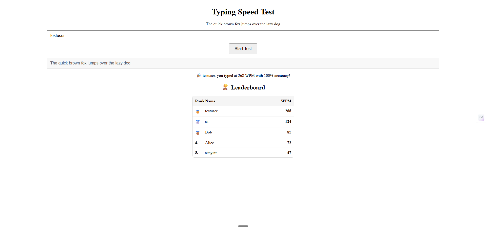

# Typing Speed Test

This project is a small React + Express + MongoDB typing speed test. It includes a frontend (Vite + React) and a backend (Express + Mongoose) that stores scores in MongoDB.

## Quick start (local)

1. Copy `.env.example` to `.env` and fill in `MONGO_URI` (if you use Atlas). For local development you can omit `MONGO_URI` to use a local MongoDB at `mongodb://127.0.0.1:27017/typingtest`.

2. Install dependencies:

```powershell
npm install
```

3. Start the backend (in one terminal):

```powershell
node ./src/server/server.js
```

4. Start the frontend (in another terminal):

```powershell
npm run dev
```

Open the Vite URL shown in the terminal (e.g. http://localhost:3000 or 3001) and the backend on http://localhost:8080.

## Security
- Do NOT commit `.env` or your MongoDB credentials. Use `.env.example` to show the required variables.

## Notes
- The server updates a user's score only if the new WPM is higher than the previous one.
- Leaderboard endpoint: `GET /leaderboard`
- Save score endpoint: `POST /score` with JSON `{ name, wpm }`.

---

## Screenshot



---

## Features

- Lightweight React frontend (Vite) with a minimal UI for running typing tests.
- Real-time WPM and accuracy calculation.
- Backend API (Express + Mongoose) that stores scores in MongoDB and returns a live leaderboard.
- Local development friendly: backend uses `process.env.MONGO_URI` with a local fallback for quick testing.

## What you can do with this project

- Run locally to practice typing and record scores.
- Extend the frontend with additional feedback (per-character accuracy, timers).
- Hook the backend to a hosted MongoDB Atlas instance for a public leaderboard.
